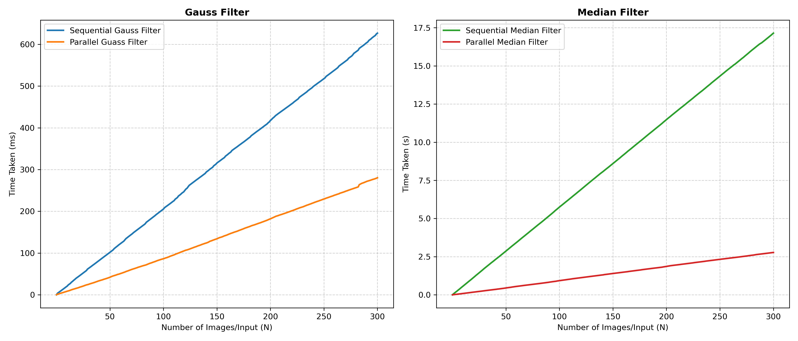

# Acceleration of Digital Image Filtering on Multicore CPUs using OpenMP

An optimized, high-performance C++ and OpenMP implementation of linear **Gaussian** and non-linear **Median** image filters, modeled after the academic paper:
> **"Acceleration of digital image filtering processes on multi-core processors using OpenMP technology"**
> *by Turdiev Ulugbek & Javliev Shakhzod (September 2025)*

This project demonstrates how to accelerate computationally intensive color image processing workloads on multi-core CPU architectures without relying on dedicated GPU hardware.

---

## Features
- **PPM (P6) Image Parser**: A pure-C++ parser for reading and writing binary PPM images without external dependencies.
- **Linear Gaussian Filter**: A 3x3 smoothing filter utilizing weighted averages to reduce uniform random noise.
- **Non-Linear Median Filter**: A 3x3 statistical filter for removing impulse (salt-and-pepper) noise while preserving image contours and edges.
- **Advanced OpenMP Worksharing**: Parallelized loops utilizing fine-grained pixel-level work distribution (`collapse(2)`) to scale effectively across core counts.
- **Zero-Allocation Dynamic Kernel Sorting**: An inlined insertion sort operating entirely on thread-private stacks to eliminate memory contention locks.
- **Full Testing Suite**: Integrates a verification module that checks parallel results against serial baselines pixel-by-pixel for absolute correctness.

---

## Academic Benchmark Comparison
The reference paper evaluated performance on an **Intel Core i7 processor (10 cores, 16 threads)** across three standard resolutions. The table below outlines the execution times (in milliseconds) and speedups achieved:

| Image Resolution | Filter Type | Sequential (ms) | OpenMP Parallel (ms) | Speedup Factor |
| :--- | :--- | :--- | :--- | :--- |
| **512 × 512** | Gaussian | 245 ms | 68 ms | ~3.6x |
| | Median | 320 ms | 92 ms | ~3.5x |
| **1024 × 1024** | Gaussian | 976 ms | 210 ms | ~4.6x |
| | Median | 1320 ms | 340 ms | ~3.8x |
| **3200 × 2400** | Gaussian | 8,640 ms | 1,580 ms | **~5.5x** |
| | Median | 11,200 ms | 2,600 ms | **~4.3x** |

These figures highlight the excellent strong scaling characteristics of OpenMP thread management as the image computational workload increases.

---

## File Structure
- `image_filter.cpp`: Main implementation including the C++ image structure, serial baseline, parallel algorithms, and verification harness.
- `image_converter.py`: Python script utilizing Pillow to convert standard image formats (`.png`, `.jpg`) into raw binary `.ppm` files and back.
- `Makefile`: Automates building the project with aggressive compiler optimization flags (`-O3`) and OpenMP thread bindings.
- `plot_benchmark.py`: Visualizes the Comparison between Sequential and Parallel Results
- `image_filtering_project_guide.md`: A comprehensive report guide explaining cache optimization, SoA data structures, thread safety, and instructions for running benchmarks.

---

## Dataset
[Salt and Pepper Noise Dataset:Clean vs Noisy Image](https://www.kaggle.com/datasets/rajneesh231/salt-and-pepper-noise-images)

---

## Build & Execution Instructions
Ensure you have GCC with OpenMP support installed.

### 1. Compile the Project
```bash
make
```
This generates the `image_filter` executable with `-O3` and `-fopenmp`.

### 2. Prepare Benchmark Images
Convert your test images (e.g., standard PNGs) to binary PPM format:
```bash
python3 image_converter.py to_ppm image_input_folder ppm_output_folder
```

### 3. Run the Filters
Run the binary to apply both filters, evaluate execution speed, and verify output correctness:
```bash
./image_filter ppm_input_folder_path output_folder_path
```

### 4. Convert Back to PNG/JPG (Optional)
```bash
python3 image_converter.py to_png input_ppm_folder output_png_folder
```

### 5. Run Benchmark to Visualize the Results
```bash
python3 plot_benchmark.py
```

---

## Results


---

## Technical Architecture Insights
- **Thread Safety**: Independent pixel-level operations are completely thread-safe because each thread writes to its own assigned indices in the output array, eliminating any race conditions.
- **Memory Locality**: Internal pixel arrays are structured linearly to prevent cache line invalidation and exploit spatial locality during 3x3 sliding window operations.
- **Vectorization**: Compiler vectorization (`-O3` auto-vectorization) is facilitated by keeping inner loops free of complex branch instructions and heap-allocated variables.
